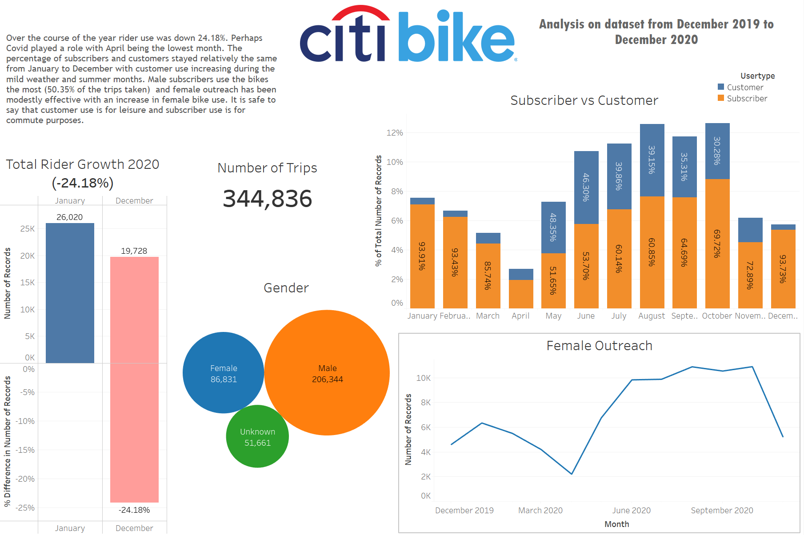
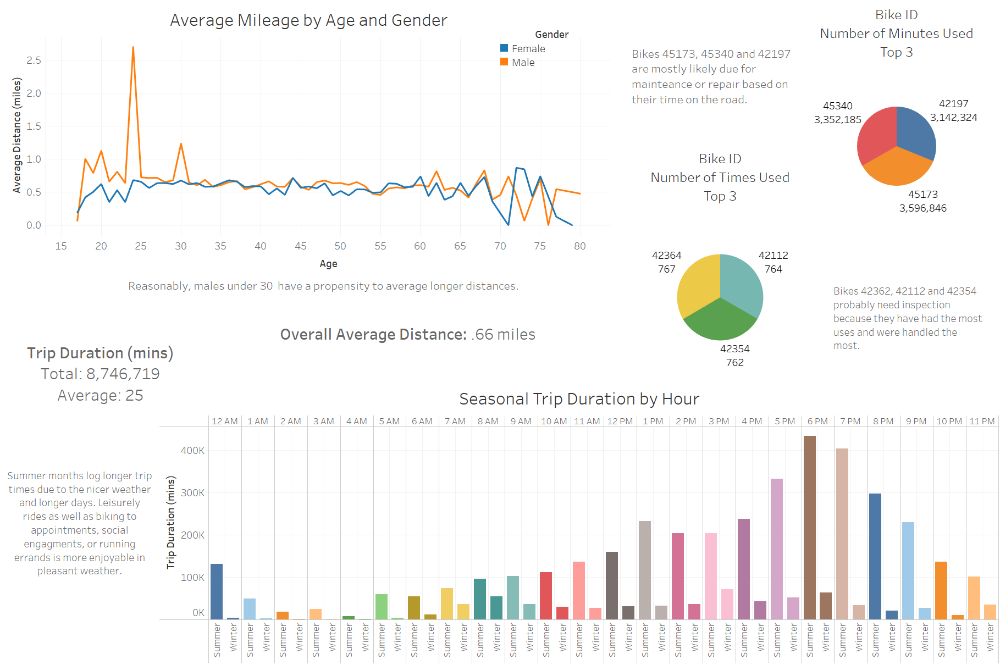
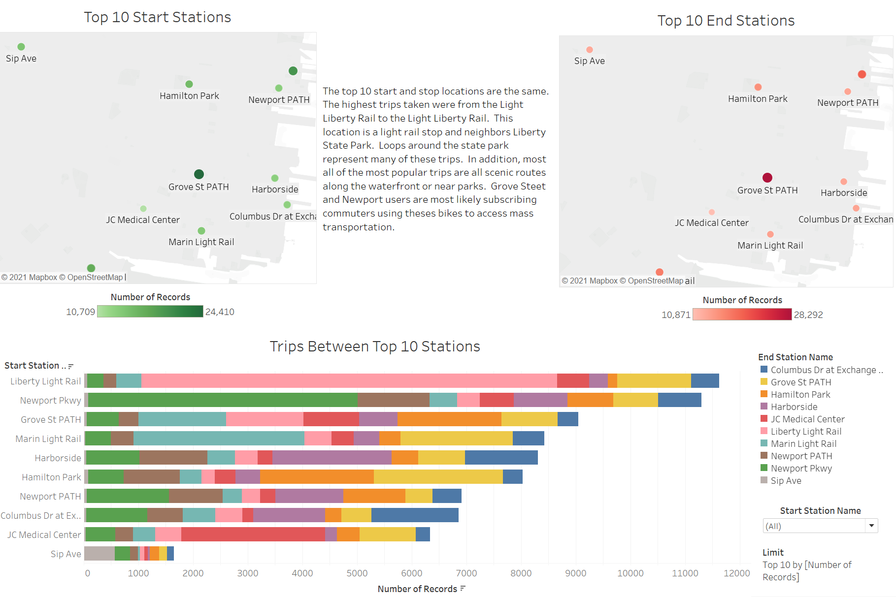
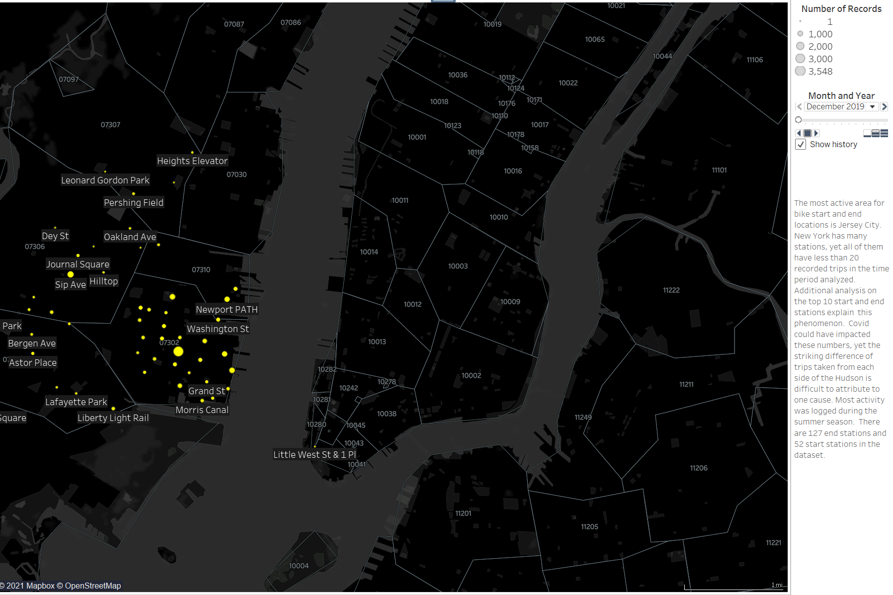

# Citi Bike Analytics
## View the Tableau Public workbook [here](https://public.tableau.com/app/profile/robin.christoffersen/viz/CitibikeAnalytics_16279562405600/CitiBikeStory?publish=yes)
---
An analysis was done on data from the largest bike sharing program in the United States.  The goal of this assigment was to find unexpected phenomena within a dataset.  Picking a relevent dataset was important and the last full year of data was chosen.  Dates range from December 2019 to December 2020.  The data selections can be found at [Citi Bike Data](https://www.citibikenyc.com/system-data).  Twelve CSV files were downloaded and then read using Pandas into dataframes.  They were then concatenated to preserve the data.  That dataframe was then output into a new CSV file named Citibike_2020.  

The output file was then used as a data source in Tableau.  Some necessary calculated fields were created.  Trip Duration(minutes), Seasons, Gender, Age, Start Point, End Point and Distance to name a few.  
***
The first analysis was done on the type of user the program sees.  There were two usertypes listed in the files: customer and subscriber.  A customer is defined as paying for a 24 hour pass or a 3-day pass.  A subscriber is an annual pass holder.  

The total number of trips logged during the time period was 344,836.  Rider Growth was examined and it was found that from December 2019/January 2020 - December 2020 rider use decreased 24.18%.  Male riders are the majority of users accounting for over 50% of trips in 2020. Most subscribers use their memberships commuting to work.  Most customers used their passes for pleasure or scenic reasons.  Overall, the percentages of these groups remained in line with the decrease in use for the year.  Subscribers far outnumber customers in the winter months.  We see an increase in customer use in the milder weather and summer months.  This could be attibuted to people wanting to use the bikes to enjoy the weather and go out for the evening.  There is a large dip in use for the month of April and that is more than likely Covid related as it is the month right after the first lockdown occured.  Female rider outreach was somewhat successful seeing a small rise in female trips when comparing December 2019 to December 2020.

***
The second analysis was done on bike use, duration and distance.  Bikes were looked at to see which would need maintence the most.  The top three bikes that were on the road the longest and had the most users were detected.  The average trip distance based on all trips was a little over half a mile at .66 miles.  The average trip duration was approximatly 25 minutes.  Expectedly, males under 30 logged longer distances than the other age groups.  Because of either not enough records or an abnormal amount of records for the older age groups, average trip durations for these older groups deviated from expected numbers.  Not everyone who use the bikes are truthful and maybe don't take the time to input accurate information.  Usage was also analyzed according to season.  Summer months are defined as June, July and August.  Winter months are defined as December, January and February.  Summer months log longer trip times due to nicer weather and longer daylight. People are more likely to run errands, go to appointments, and attend social engagements via bike.  The longer trip durations during after work hours reinforce this idea. An additional analysis was done on the most popular day of the week to take a trip.  During the summer months, Saturday and Sunday registered longer trip durations and higher number of trips.  During the winter months, weekdays recorded higher number of trips taken and trip durations were relatively the same across all days.  Furthermore, trip duration during winter months was low overall because of cold tempatures and hostile conditions.

***
The third analysis was done on station locations.  The top 10 start and stop locations are the same.  The highest trips taken were from the Light Liberty Rail to the Light Liberty Rail.  This location is a light rail stop and neighbors Liberty State Park.  Loops around the state park represent many of these trips.  In addition, most all of the most popular stations and consequently their respective popular trips are scenic routes along the waterfront or near parks.  Grove Steet and Newport users are most likely subscribing commuters using theses bikes to access mass transportation.  Hamilton Park is a historic neighborhood in downton Jersey City.  Public transportation nearest to this residential area is the Grove Street PATH.  This explains the two stations being in the top 10 as well as the routes between them.  These observations reinforce that customers use their passes for tourist or leisure type activity while subscribers use their memberships for commuting.

***
Finally, a map was created showing all the stations recorded in the dataset and the popularity of those stations over time.  There are a total of 127 stations in the dataset.  The most active area for bike start and end locations are in Jersey City.  The reason for this has been previously explained.  You can see trips were seriously affected for the months of April and May when Covid lockdown occured.  The stations in New York logged less than 20 trips during the time period.  Covid might have impaced these numbers yet the striking difference between trips taken from each side of the Hudson is difficult to attribute to on cause.  Most activity was logged during the summer months.

